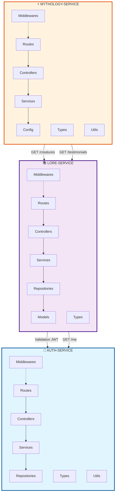

```mermaid
graph TB
subgraph AUTH["🔐 AUTH-SERVICE"]
direction TB
A1[Controllers]
A2[Middlewares]
A3[Repositories]
A4[Routes]
A5[Services]
A6[Types]
A7[Utils]

        A4 --> A1
        A1 --> A5
        A5 --> A3
        A2 -.-> A4
    end

    subgraph LORE["📚 LORE-SERVICE"]
        direction TB
        L1[Controllers]
        L2[Middlewares]
        L3[Models]
        L4[Repositories]
        L5[Routes]
        L6[Services]
        L7[Types]

        L5 --> L1
        L1 --> L6
        L6 --> L4
        L4 --> L3
        L2 -.-> L5
    end

    subgraph MYTH["⚡ MYTHOLOGY-SERVICE"]
        direction TB
        M1[Config]
        M2[Controllers]
        M3[Middlewares]
        M4[Routes]
        M5[Services]
        M6[Types]
        M7[Utils]

        M4 --> M2
        M2 --> M5
        M5 --> M1
        M3 -.-> M4
    end

    %% Interactions entre microservices
    LORE -->|Validation JWT| AUTH
    LORE -->|GET /me| AUTH
    MYTH -->|GET /creatures| LORE
    MYTH -->|GET /testimonials| LORE

    %% Styling
    classDef authStyle fill:#e1f5ff,stroke:#01579b,stroke-width:3px
    classDef loreStyle fill:#f3e5f5,stroke:#4a148c,stroke-width:3px
    classDef mythStyle fill:#fff3e0,stroke:#e65100,stroke-width:3px

    class AUTH authStyle
    class LORE loreStyle
    class MYTH mythStyle
```
